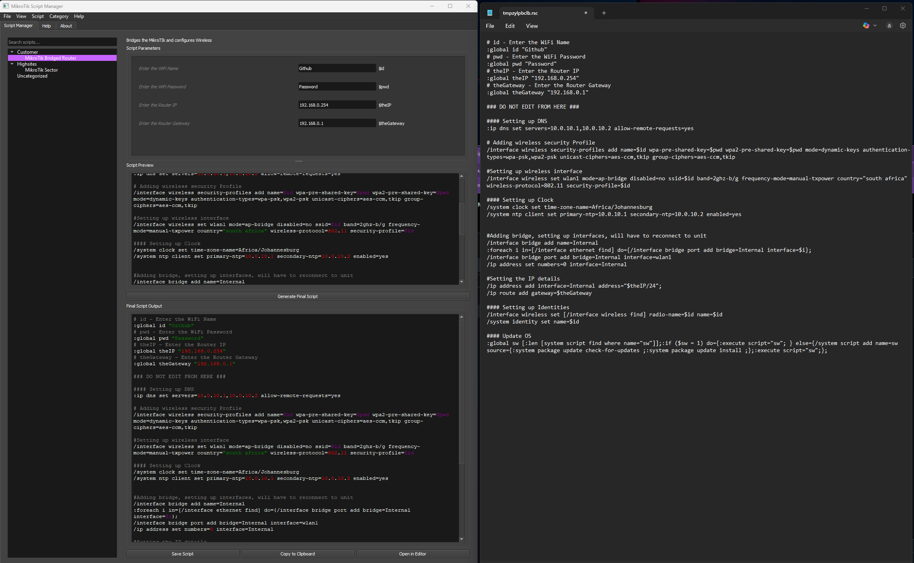
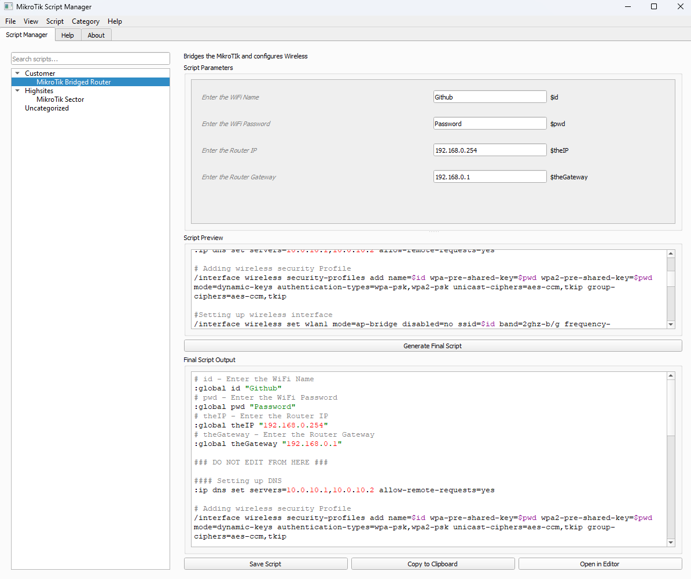
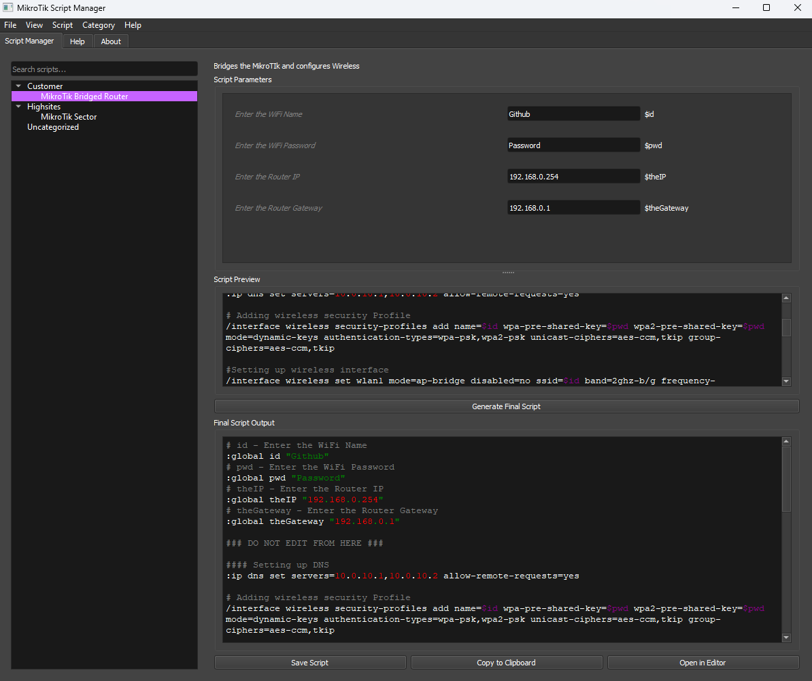

# MikroTik Script Manager 🌐✨

  
*Elegant GUI for managing RouterOS scripts*

A feature-rich desktop application for creating, organizing, and managing MikroTik RouterOS scripts with a beautiful interface.

## 🚀 Features

- **Code Editor with Syntax Highlighting**  
  Syntax Highlighting Demo
- **Smart Variable Management**  
  Edit script parameters through intuitive forms
- **Project Organization**  
  Categorize scripts with drag-and-drop
- **Dark/Light Mode Toggle**  
- **GitHub Integration**  
  Import scripts directly from raw GitHub URLs
- **Cross-Platform**  
  Runs on Windows, macOS and Linux

## 💻 Screenshots

| Light Mode | Dark Mode |
|------------|-----------|
|  |  |

📦 Requirements
Python 3.6+

PyQt5

🛠️ Built With
PyQt5 - GUI Framework

🤝 Contributing
Pull requests are welcome! Please open an issue first to discuss changes.

📜 License
 © NorthFi

## ⚙️ Installation

```bash
# Clone & run
git clone https://github.com/NorthFi/mikrotik-script-manager-py.git
cd mikrotik-script-manager-py
pip install -r requirements.txt
python src/main.py
